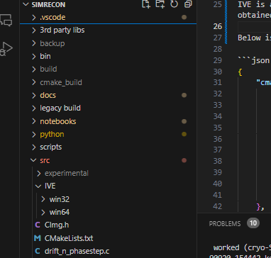

## C code Build Process  

The build uses CMake. The CMake file is [here](../src/CMakeLists.txt).  

The recommended way to start the build is from Visual Studio Code. For convenience, I have added the [.vscode](../.vscode) files to the GitHub repo. The directory locations need to be changed for local computers.

You will need to install the CMake and C/C++ extension. 

It is recommended to use the MinGW compiler as there seems to be incompatibilities between IVE and newer microsoft compilers.  

Mingw can be found [here](https://www.msys2.org/docs/environments/).  Note use the ```ucrt64``` version.  

After installing mingw add below to the windows system path. 

```
c:\msys64\ucrt64\bin
```

## Dependencies  

The dependencies required are listed in [settings.json](../.vscode/settings.json).  

Dependencies needed are [OpenBLAS](https://www.openblas.net/), [LAPACK](https://www.netlib.org/lapack/), and [FFTW](https://www.fftw.org/).  

IVE is also needed for MRC support.  Many groups involved in SIM have already obtained the IVE library.  If you do not have it check with members of your instuition involved in SIM to see if your institution has already obtained IVE.  If not you will need to contact UCSF to obtain IVE.  

After obtaining IVE library place the IVE folder underneath the ```src``` directory as shown in the below screen shot. 



Below is the settings file I (bnort) have used on my machine.   You will need to set up something similar on your machine. 

```json
{
    "cmake.configureSettings": {
        "cmake.generator": "MinGW Makefiles",
        "CMAKE_BUILD_TYPE": "Debug",
        "CMAKE_INSTALL_PREFIX": "${env:CONDA_PREFIX}",
        "BLAS_LIBRARIES": "C:/Users/bnort/work/tools/OpenBLAS-0.3.27-x64/lib/libopenblas.lib",
        "LAPACK_LIBRARIES": "C:/Users/bnort/work/tools/LAPACKE/LAPACK.lib",
        "FFTW_INCLUDE_DIRS": "C:/Users/bnort/work/tools/fftw-3.3.5-dll64",
        "FFTW_FLOAT_LIB": "C:/Users/bnort/work/tools/fftw-3.3.5-dll64/libfftw3f-3.lib",
        "FFTW2_INCLUDE_DIRS": "D:/Janelia/scripts/SIMrecon_svn/usr_local/include",
        "FFTW2_FLOAT_LIB": "D:/Janelia/scripts/SIMrecon_svn/usr_local/lib/libsfftw.lib",
        "FFTW2_FLOAT_LIBR": "D:/Janelia/scripts/SIMrecon_svn/usr_local/lib/libsrfftw.lib"
    },
    "cmake.sourceDirectory": "${workspaceFolder}/src"
}
```

