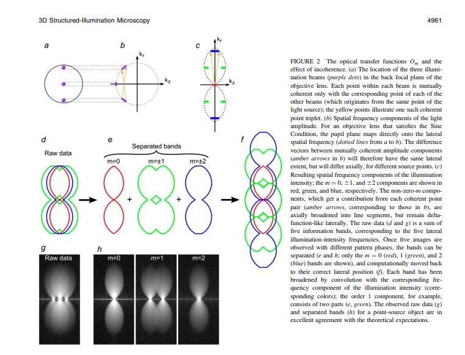
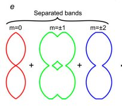

# 3D SIM algorithm and simrecon.c implementation notes

This document describes the ```sirecon.c``` file which implements the algorithm described in [Three-Dimensional Resolution Doubling in Wide-Field Fluorescence Microscopy by Structured Illumination](https://pmc.ncbi.nlm.nih.gov/articles/PMC2397368/pdf/4957.pdf), Gustafsson, Shao, etc. al. 

## Summary of code

All processing code is in a single file simrecon.c.

Main simrecon routine starts around [line 69](https://github.com/True-North-Intelligent-Algorithms/simrecon/blob/main/src/sirecon.c#L69).

### File IO

Files are opened using IVE Library starting around [line 150 to line 350](https://github.com/True-North-Intelligent-Algorithms/simrecon/blob/main/src/sirecon.c#L150)

Optionally can use .tif reader. To use tiff reader need to set following preprocessor directive 

```
__SIRECON_USE_TIFF__
```

### Threads

Number of threads to use is a parmeter and set at [line 370](https://github.com/True-North-Intelligent-Algorithms/simrecon/blob/main/src/sirecon.c#L370)

Search for the following code snippet to adjust the thread setting logic. 

```
if (myParams.nthreads == -1) {
#ifndef NDEBUG
  nthreads = 1;
#else
#ifdef _WIN32
  SYSTEM_INFO siSysInfo;
  GetSystemInfo(&siSysInfo);
  nthreads = siSysInfo.dwNumberOfProcessors;
#else
  nthreads = sysconf(_SC_NPROCESSORS_CONF); /* Get number of processors */
#endif
#endif
} 
else {
  nthreads = myParams.nthreads;
}
  omp_set_num_threads(nthreads);
  printf("Number of threads used: %d\n", nthreads);

```

If ```nthreads``` is not passed in as a parameters and we are not debugging, the number of threads will be based on the number of processors. 

If ```nthreads``` is passed in we recommend the following values.

** Tiled ** : Number of threads should be 1 because the Python code threads the tiles.  If both python code and c code start multiple threads, OS thread management can become a bottleneck. 

** Non-tiled **:  Try not using ```nthreads```.  If performance is slow try an ```nthreads``` value slightly lower than the number of cores.  

### Memory allocation and FFT setup

This is done from [line 380 to about line 500](https://github.com/True-North-Intelligent-Algorithms/simrecon/blob/main/src/sirecon.c#L380).

### Main processing loop

begins at about [line 522](https://github.com/True-North-Intelligent-Algorithms/simrecon/blob/main/src/sirecon.c#L522)

### drift detection

done at [line 550 to about 600](https://github.com/True-North-Intelligent-Algorithms/simrecon/blob/main/src/sirecon.c#L550)

### makematrix

Generates the matrix that is used to separate the raw data into the different bands of the sample information, done at [about line 465](https://github.com/True-North-Intelligent-Algorithms/simrecon/blob/main/src/sirecon.c#L464).  Figure 2 in [Gustafson, Shao, etc. al](https://pmc.ncbi.nlm.nih.gov/articles/PMC2397368/pdf/4957.pdf) show the concept. 



The makematrix call is as below.  

```
 makematrix(nphases, norders, 0, 0, sepMatrix, noiseVarFactors);
```

### Load image flatfield, perform FFT, fix 2D drift, fix Phase, and separate

These steps are done at about [line 670](https://github.com/True-North-Intelligent-Algorithms/simrecon/blob/main/src/sirecon.c#L670).  Search for the following code snippet. 

```
 load_and_flatfield(istream_no, zsec, iw, it, rawImages[phase]+(z+zoffset)*nxy, buffer,
                               nx, ny, background, backgroundExtra, slope, inscale, myParams.bUsecorr);
```

The FFT is performed at about [line 695]([line 670](https://github.com/True-North-Intelligent-Algorithms/simrecon/blob/main/src/sirecon.c#L695).

See following code snippet

```
for (phase=0; phase<nphases; phase++) {
            fftwf_execute_dft_r2c(rfftplan, rawImages[phase]+(z+zoffset)*nxy, (fftwf_complex *) (rawImages[phase]+(z+zoffset)*nxy));
            if (myParams.nOffImages)
              fftwf_execute_dft_r2c(rfftplan, offImages[phase]+(z+zoffset)*nxy, (fftwf_complex *) (offImages[phase]+(z+zoffset)*nxy));
          }
```

Fix 2D drift is done at about [line 740](https://github.com/True-North-Intelligent-Algorithms/simrecon/blob/main/src/sirecon.c#L740).

Fix phase is done at about [line 764](https://github.com/True-North-Intelligent-Algorithms/simrecon/blob/main/src/sirecon.c#L764).

Search for following code snippet  

```
 if (myParams.bFixPhaseStep) {
              // makematrix() takes into account phase error, based on drift estimate and acquisition-time phase correction
              calcPhaseList(phaseList, driftlist, phaseAbs,
                            myParams.k0startangle+direction*delta_angle, myParams.linespacing, dxy,
                            myParams.nOffImages, nphases, nz, direction, z);

              makematrix(nphases, norders, direction, phaseList, sepMatrix, noiseVarFactors);
            }
```

Separate is called at about [line 775](https://github.com/True-North-Intelligent-Algorithms/simrecon/blob/main/src/sirecon.c#L775).

```
separate(nx, ny, z+zoffset, direction, nphases, norders, rawImages, sepMatrix);  // unmixing of components in real or reciprocal space
```

### Z direction FFT

This is done at about [line 790](https://github.com/True-North-Intelligent-Algorithms/simrecon/blob/main/src/sirecon.c#L790)

### Make input a point source

This is done with an option called ```makemodel``` and is very useful for debussing.  This is done around line 800

Search for following code snippet

```
  if (myParams.bMakemodel)
          /* Use the OTF to simulate an ideal point source; replace bands with simulated data */
          makemodeldata(nx, ny, nz0, bands, norders, k0[direction], dkx, dky, dz, otf, wave[iw], &myParams);
```

### Parameter estimation

After separation and FFT, the array rawImages, now referred to as the array bands[], contains the center band (bands[0]), and the real (bands[1], bands[3], etc.) and imaginary part (bands[2], bands[4], etc.) bands of the different orders (see below figure from Gustafsson, Shao, et al)



The ```simrecon.c``` code implements the process descripted in Gustafsson, Shao, et al, Methods section: Parameter fitting section.

```
The precise values of the pattern wave vector **p**, the starting phase, and the modulation depths are determined from the data by comparing the different information components in the regions of frequency space where they overlap.   
```

Details of this optization process are output to text files.  The text files contain several types of information but to inspect results of the pattern wave vector search find a line similar to below...  

```
k0guess[direction 0] = (0.459975, 1.594829) 1/micron
```

This is the value of **k0** passed into the program. 

#### findk0 (initial value calculated with cross correlation)

The ```findk0``` function is used to find the first estimation of the modulation wave vector using cross correlation.  This is called around [line 824](https://github.com/True-North-Intelligent-Algorithms/simrecon/blob/main/src/sirecon.c#L824)  

```
  findk0(bands, overlap0, overlap1, nx, ny, nz0, norders, &(k0[direction]), dxy, dz, otf, wave[iw], &myParams);
```

The overlaps are created in a function called ```makeoverlaps```.  See  [line 1392](https://github.com/True-North-Intelligent-Algorithms/simrecon/blob/main/src/sirecon.c#L1392) or search for...  

```
makeoverlaps(bands, overlap0, overlap1, nx, ny, nz, fitorder1, fitorder2, (*k0).x, (*k0).y, dxy, dz, OTF, wave, pParams);
```

After ```findk0``` the output is printed in the text tile (or on terminal).  

```
Initial guess by findk0() of k0[direction 0] = (0.331365,1.548348) 1/micron
```

#### fitk0andmodamps (parabolic interpolation)

After cross correlation the following is called to find **k0** at sub-pixel accuracy.   

```
 fitk0andmodamps(bands, overlap0, overlap1, nx, ny, nz0, norders, &(k0[direction]),
                          dxy, dz, otf, wave[iw], amp[direction], &myParams);
```

Around [line 1705](https://github.com/True-North-Intelligent-Algorithms/simrecon/blob/main/src/sirecon.c#L1705) a iterative search is done to find first the best anngle, then the best magnitude.  In the text file you should find a series of lines as below, where first the angle is changing but magnitude fixed, then magnitude is changing but angle fixed (each time amp and phase are re-calculated).  At the end of each optimization cycle ```fixxyparabola``` is called.

```
In getmodamp: angle=1.359965, mag=1.583409, amp=0.551916, phase=1.405598
In getmodamp: angle=1.360965, mag=1.583409, amp=0.537863, phase=1.399390
In getmodamp: angle=1.358965, mag=1.583409, amp=0.541540, phase=1.417284
In getmodamp: angle=1.359891, mag=1.583409, amp=0.551971, phase=1.406298
In getmodamp: angle=1.359891, mag=1.584877, amp=0.506728, phase=1.396872
In getmodamp: angle=1.359891, mag=1.581941, amp=0.565902, phase=1.419746
In getmodamp: angle=1.359891, mag=1.580473, amp=0.546755, phase=1.434790
```

Finally the modulation amplitudes are recalculated and the following is output to the text file.  The first set of ```Optimum modulation amplitudes``` are (in 3D) for order 2, and the second set is for order 1.  The text snippet ```order 1 otherorder``` is important because it allows the python code to find amplitudes and order 2 and order 1 with regex. 

```
Optimum modulation amplitude:
 In getmodamp: angle=1.359207, mag=1.581906, amp=0.503053, phase=-3.102185
 Reverse modamp is: amp=1.545402, phase=-3.102185
 Combined modamp is: amp=0.802949, phase=-3.102185
 Correlation coefficient is: 0.571204
Optimum k0 angle=1.359207, length=1.581906 (1/microns), spacing=0.632149 microns
Optimum modulation amplitude for order 1 otherorder:
 In getmodamp: angle=1.359207, mag=1.581906, amp=1.330485, phase=-1.855998
 Reverse modamp is: amp=4.948702, phase=-1.855998
 Combined modamp is: amp=4.423178, phase=-1.855998
 Correlation coefficient is: 0.519237
```

At the very end the percent off expected value is printed to the text file/terminal.  

```
best fit for k0 is 6.917648 percent off expected value.
```

### Force and constrain amplitudes

The amplitudes seem to be the more unstable than angle and magnitude, thus sometimes (especially if ```filteroverlaps``` is false) it makes sense to define these explicityly.  The code which sets amplitudes explicitly and the code the applies constraints to the amplitudes starts at around [line 890]()(https://github.com/True-North-Intelligent-Algorithms/simrecon/blob/main/src/sirecon.c#L1890)   

search for the following code snippet

```
       if (myParams.forceamp[1] > 0.0)   /* force modamp's amplitude to be a value user provided (ideally should be 1)  */
          for (order=1;order<norders;order++) {
            float a = cabsf(amp[direction][order]);
            // BN commenting out this if statement to allow higher a factors
            //if (a<myParams.forceamp[order]) {
              ampfact = myParams.forceamp[order]/a;
              amp[direction][order] *= ampfact;
              printf("modamp mag=%f, phase=%f  \n",cabsf(amp[direction][order]),
                     cargf(amp[direction][order]));
            //}
          }

        // BN: Here we constrain amp to be between ampmin and ampmax, and check if amp is nan or infinite
        // (this is helpful as a constraint for tiled reconstructions where sometimes a tile has an unrealistic amp)
        if (myParams.ampmin[1] > 0.0)   /* force modamp's amplitude to be above ampmin  */
          for (order=1;order<norders;order++) {
            float a = cabsf(amp[direction][order]);

            if ( isnan(a) || !isfinite(a)) {
              amp[direction][order] = 1.0 + 0*I;
            }
            else if (a<myParams.ampmin[order]) {
              ampfact = myParams.ampmin[order]/a;
              amp[direction][order] *= ampfact;
              printf("modamp mag=%f, phase=%f  \n",cabsf(amp[direction][order]),
                     cargf(amp[direction][order]));
            }
          }

        if (myParams.ampmax[1] > 0.0)   /* force modamp's amplitude to be below ampmax  */
          for (order=1;order<norders;order++) {
            float a = cabsf(amp[direction][order]);

            if ( isnan(a) || !isfinite(a)) {
              amp[direction][order] = 1.0 + 0*I;
            }
            else if (a>myParams.ampmax[order]) {
              ampfact = myParams.ampmax[order]/a;
              amp[direction][order] *= ampfact;
              printf("modamp mag=%f, phase=%f  \n",cabsf(amp[direction][order]),
                     cargf(amp[direction][order]));
            }
          }
```

### Filter and assemble bands

See Gustafsson, Shao, et al, Methods Section, Reconstruction Section, for full explanation and equation (11).  Essentially the different frequency components are combined through a generalized Wiener filter with an Apodization term.  Each component is the OTF weighted sum of all bands at that frequency (bands overlap in frequency space) weighted by a normalization term composed of the OTF weights at each band.  An apodization term is also applied.  

Eq. 11 is implemented in a non-intuitive way.  Each unshifted component is weighted individually, padded, and transformed to real space then multiplied by the complex phase gradient which represents the frequency space shift.   

The first part is done in ```filterbands``` and the second in ```assemblereadspacebands````. 

```
filterbands(direction, bands, k0, ndirs, norders, otf, dxy, dz,
                    amp, noiseVarFactors, nx, ny, nz0, wave[iw], &myParams);

        /* FFT back to real space and assemble */
        printf("before assemblerealspacebands\n");
        assemblerealspacebands(direction, outbuffer, bigbuffer, bands, ndirs, norders, k0, dxy, nx, ny, nz0,
                               fftplan, myParams.zoomfact, myParams.z_zoom, myParams.explodefact, myParams.bNoOrder0);
```

### filterbands

Prepares the bands to be assembled:  Applies appropriate OTF-based weighting in the overlaps, uses a Wiener like filter.

- called for each direction

### assemblereadspacebands

Assembles bands in real space.  Calls move.  ```assemblerealspacebands``` is called once for each direction. 

#### move(...)

Moves the contents of the complex fourier space array of size ```(nx/2+1)*ny``` to a bigger array of size ```(zoomfact*nx)*(zoomfact*ny)```.  In most cases ```zoomfact``` is 2. 
- called for each direction

#### After ```move``` is called

- for 3D, each direction has 3 orders.  Order 0 remains at the origin (or frequency space).  Order 1 is shifted by ```mag```.  Order 2 is shifted by 2*```mag```.  